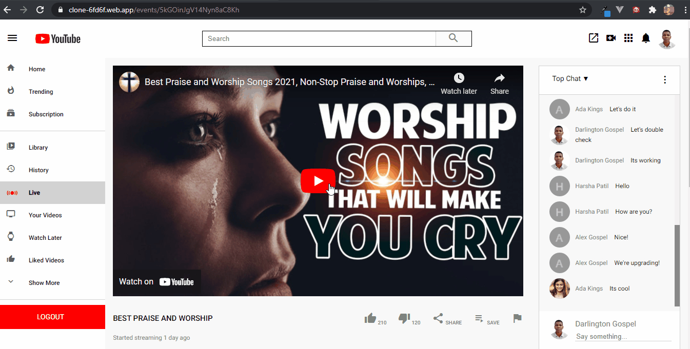
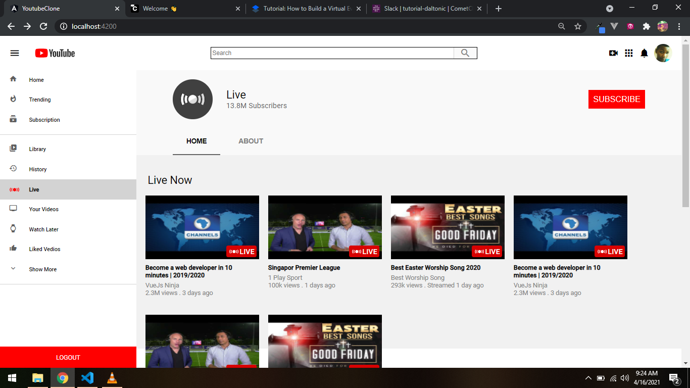

# Virtual Event Site (Youtube-Live Clone)

Read the full tutorial here:

[**>> How To Build A Virtual Event Site With Angular (Youtube-Live Clone)**](https://www.cometchat.com/tutorials/#)

This example shows How To Build A Virtual Event Site With Angular:


<figcaption>YouTube Live Clone</figcaption>


<figcaption>YouTube Live Clone Home Component</figcaption>


## Technology
This demo uses:

* CometChat Pro 2.2.1
* Firebase
* Angular
* Angular-Material Icons
* Angular-Youtube Player

## Running the demo

To run the demo follow these steps:

1. [Head to CometChat Pro and create an account](https://www.cometchat.com/pro?utm_source=github&utm_medium=link&utm_campaign=NAMEOFREPO)
2. From the [dashboard](https://app.cometchat.com/signup?utm_source=github&utm_medium=link&utm_campaign=NAMEOFREPO), add a new app called "youtube-clone"
3. Select this newly added app from the list.
4. From the Quick Start copy the APP_ID, REGION and AUTH_KEY. These will be used later.
5. Navigate to the Users tab, and delete all the default users and groups leaving it clean (very important).
6. Get the Angular CLI installed on your machine by entering this command on your terminal.
  ```sh
  npm install -g @angular/cli
  ```
7. Download the repository [here](https://github.com/Daltonic/youtube-live-clone/archive/master.zip) or by running `git clone https://github.com/Daltonic/youtube-live-clone.git` and open it in a code editor.
8. [Head to Firebase and create a new project](https://console.firebase.google.com)
9. Open the "environment.ts" file in the project.
10. Enter your secret keys from cometChat and Firebase in this manner.
  ```ts
    
    firebase: {
        apiKey: 'xxx-xxx-xxx-xxx-xxx-xxx-xxx-xxx',
        authDomain: 'xxx-xxx-xxx-xxx-xxx-xxx-xxx',
        databaseURL: 'xxx-xxx-xxx-xxx-xxx-xxx-xxx-xxx-xxx',
        projectId: 'xxx-xxx-xxx',
        storageBucket: 'xxx-xxx-xxx-xxx-xxx',
        messagingSenderId: 'xxx-xxx-xxx',
        appId: 'xxx-xxx-xxx-xxx-xxx-xxx-xxx-xxx',
        measurementId: 'xxx-xxx-xxx',
    },
    APP_ID: 'xxx-xxx-xxx',
    AUTH_KEY: 'xxx-xxx-xxx-xxx-xxx-xxx-xxx-xxx',
    APP_REGION: 'xx',

  ```

12. Copy the same settings into the "environment.prod.ts" as well.
13. Run the following command to install the comet chat SDK.

```sh
    npm install
```

Questions about running the demo? [Open an issue](https://github.com/Daltonic/youtube-live-clone/issues). We're here to help ✌️


## Useful links

- 🏠 [CometChat Homepage](https://www.cometchat.com/pro/?utm_source=github&utm_medium=link&utm_campaign=NAMEOFREPO)
- 🚀 [Create your free account](https://app.cometchat.com/signup/)
- 📚 [Documentation](https://prodocs.cometchat.com/?utm_source=github&utm_medium=link&utm_campaign=NAMEOFREPO)
- 👾 [GitHub](https://www.github.com/cometchat-pro)
- 🔥 [Firebase](https://console.firebase.google.com)
- 🔷 [Angular](https://angular.io)
- 🔶 [Angular Material Icon](https://material.angular.io/)
- 💠 [Angular Youtube Player](https://www.npmjs.com/package/@angular/youtube-player)
- ✨ [Live Demo](https://clone-6fd6f.web.app/)